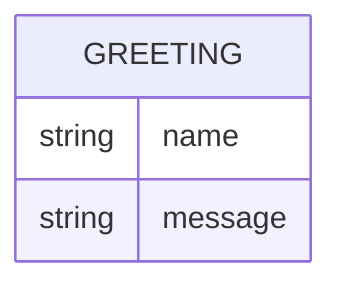

# Domain model

Greeter has no persisted data — every request is answered in memory and
nothing survives a restart. The one shape worth naming is the greeting the
service hands back.

`Greeting` is never stored: it is computed per request from the `name` query
parameter (or the default "World") and returned as the response body.